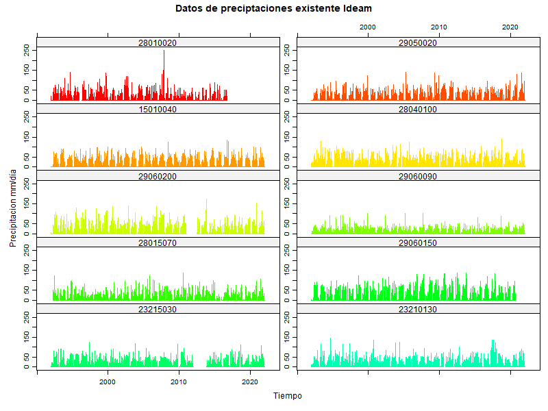
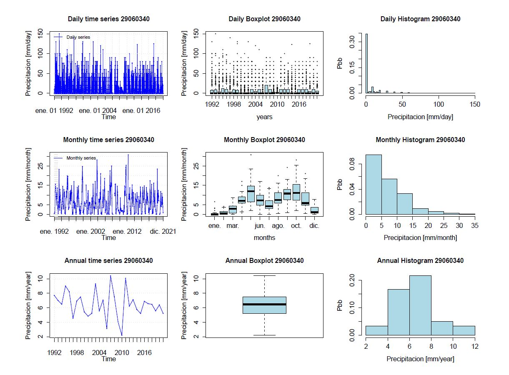
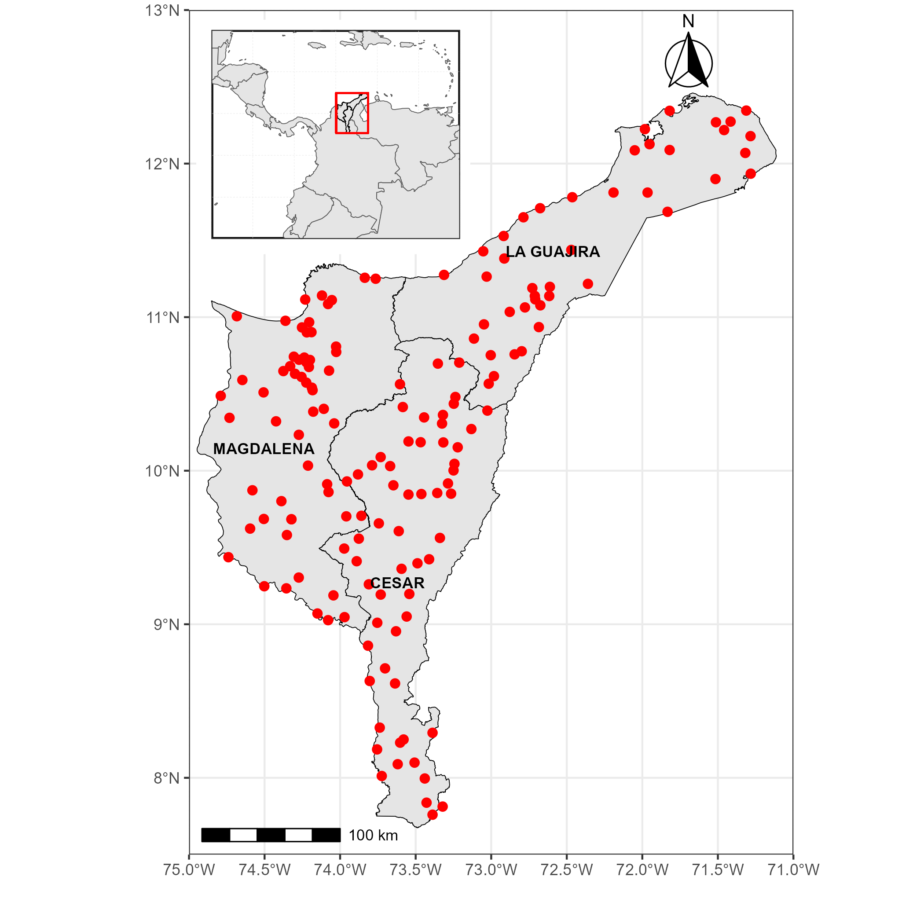
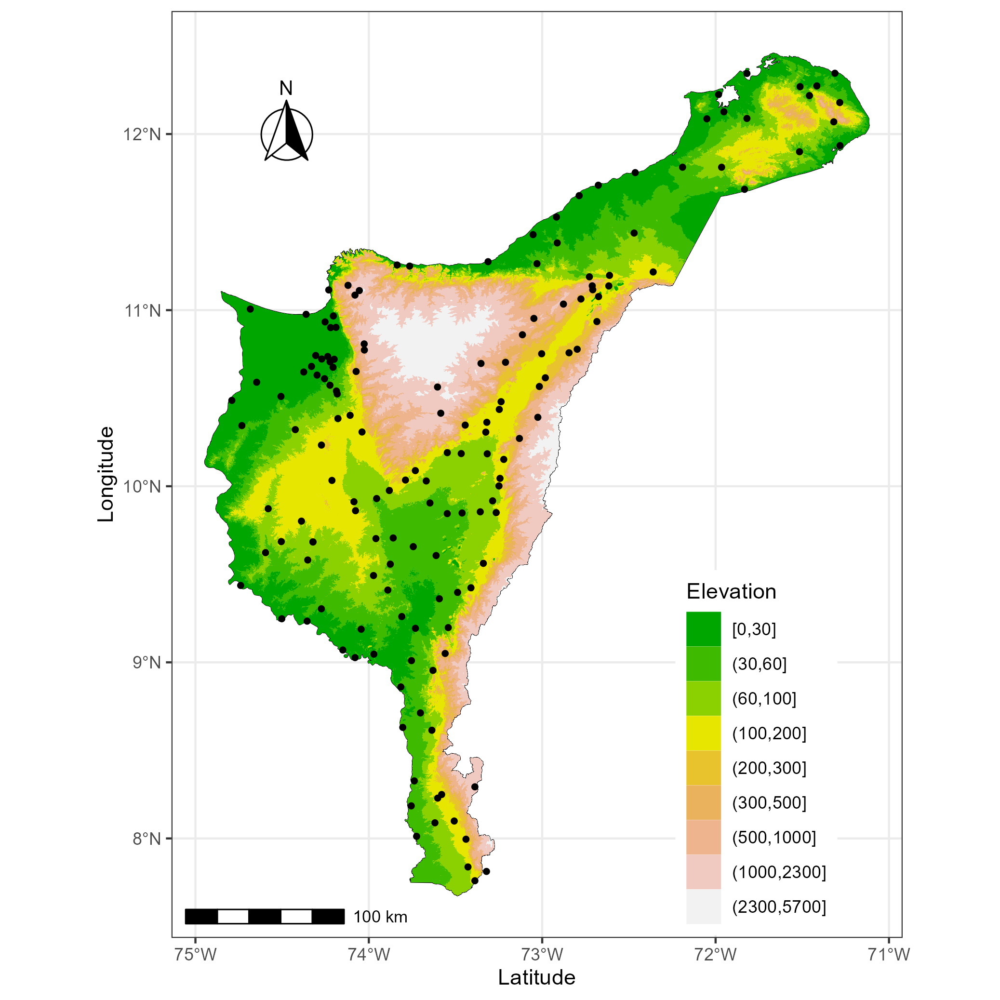
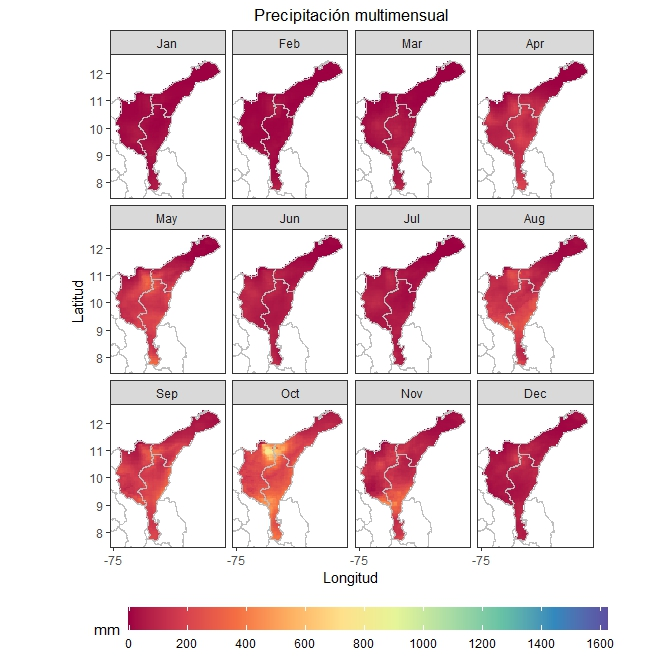
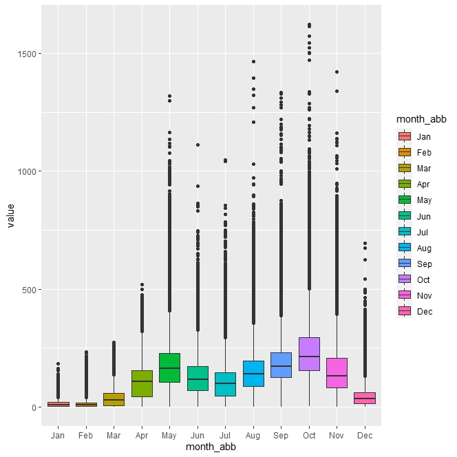
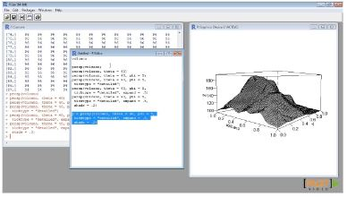
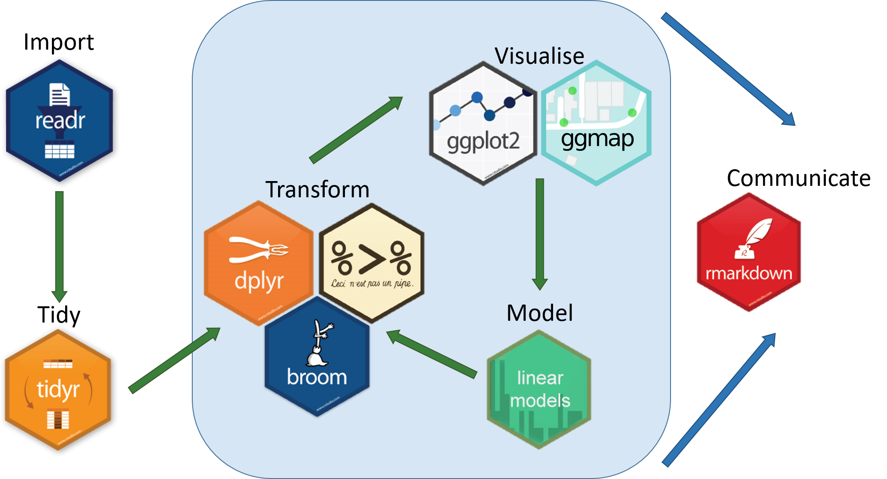

```{r setup, include=FALSE, cache=FALSE, message=FALSE, warning=FALSE, results="hide"}
library(knitr)
library(xtable)
library(tidyverse)
library(stevemisc)

knitr::opts_chunk$set(echo = FALSE)
knitr::opts_chunk$set(cache=TRUE)
knitr::opts_chunk$set(fig.path='figs/')
knitr::opts_chunk$set(cache.path='cache/')
knitr::opts_chunk$set(echo = FALSE,
              out.width = "75%", 
              fig.align = "center",
              warning = FALSE,
              cache = TRUE)


```

## **Objetivos del curso**

### **Objetivo General**

-   Desarrollar competencias necesarias para realizar análisis de datos utilizando RStudio para el monitoreo de sequías, aplicando técnicas modernas y buenas prácticas en el manejo de datos.

### **Objetivos Específicos**

-   Introducir a los participantes al entorno de RStudio y al lenguaje de programación R
-   Proporcionar a los estudiantes las habilidades necesarias para importar, limpiar y transformar datos
-   Facilitar la comprensión y aplicación de índices de sequías, así como la creación mapas

## **Justificación del curso**

-   La programación es una herramienta fundamental para todo profesional [@rahman2023], la habilidad de programar permite a las personas abrirse al mundo [@goldiamond2022].

-   Los lenguajes de programación "open acces" permiten un mejor desarrollo de competencias y habilidades en los estudiantes [@silva2020].

-   El análisis de datos para el manejo efectivo de las sequías es uno de los desafíos más críticos a nivel global [@díazmercado2022], especialmente en regiones vulnerables donde los efectos del cambio climático agravan la escasez de agua.

-   Las sequías no solo afectan la disponibilidad de recursos hídricos, sino que también repercuten negativamente en la agricultura, la biodiversidad y el bienestar de las comunidades [@vicente-serrano2010].

-   Para enfrentar estos desafíos, es necesario contar con herramientas avanzadas que permitan monitorear, analizar y predecir eventos de sequía de manera precisa y eficiente [@west2019].

## **Contenido del curso**

### **Módulo 1: Introducción a R y RStudio**

1.1. Presentación del entorno R y RStudio

1.2. Manipulación de datos en R 

\pause

### **Módulo 2: Fundamentos de la sequía**

2.1. Conceptos básicos de la sequía

2.2. Índices de sequía: conceptos y fundamentos

\pause

### **Módulo 3: Monitoreo de la sequía**

3.1. Fuentes de datos hidrometeorológicos

3.2. Estimación del Índice Estandarizado de Precipitación

3.2. Cálculo de la duración, severidad e intensidad de la sequía

\pause

### **Módulo 4: Visualización de datos de sequía**

4.1. Gráficos básicos en R

4.2. Mapas y visualización espacial de la sequía


## Aprendizaje esperado

\centering

{width="90%"}

## Aprendizaje esperado

\centering

{width="90%"}

## Aprendizaje esperado

\centering

{width="70%"}

## Aprendizaje esperado

\centering

{width="66%"}

## Aprendizaje esperado

\centering

{width="67%"}

## Aprendizaje esperado

\centering

{width="67%"}

## Aprendizaje esperado

\centering

{width="75%"}

## Aprendizaje esperado

\centering

{width="647" height="293"}

## Hablemos de R y Rstudio

```{r, out.width="25%", fig.align='center'}


```

-   R es un lenguaje de **programación** y es un software libre

-   RStudio es la interfaz de usuario más conocida (hace que R sea amigable e incluye herramientas para facilitar el trabajo)

-   R es un lenguaje orientado a **objetos** en donde pueden aplicarse **funciones** a estos objetos.

## Por qué usar R

-   Es un software libre y gratuito

-   Permite hacer investigación reproducible:

    -   El flujo de trabajo queda escrito en código
    -   Los análisis se hacen dentro del mismo programa

-   Es una herramienta potente y está en constante desarrollo de nuevas funcionalidades.

-   Existe una gran comunidad alrededor del mundo que siempre está dispuesta a enseñar, responder preguntas y desarrollar nuevos paquetes.

-   Aprender a **buscar en Google** es primordial

## R Base v/s tidyverse

::: columns
::: column
### R Base

```{r, out.width="50%",fig.align='center'}

```

-   Programar con la sintaxis nativa de R
-   Índices de objetos se realizan con: `$ , [ ], [,] o [[]]`
-   Funciones incluidas en el paquete base (base::)
:::

::: column
### R Tidyverse

```{r, out.width="50%", fig.align='center'}

```

-   Grupo de paquetes diseñados para hacer ciencia de datos
-   Busca una programación más intuitiva. Funciones como verbos.
-   Todos los paquetes comparten una filosofía de diseño, gramática y estructuras de datos subyacentes.
-   Operador "pipe" %\>%
:::
:::

## Libros

::: columns
::: column
```{r, fig.cap="Geocomputation with R"}
knitr::include_graphics("images/cover.png")
```
:::

::: column
```{r, fig.cap="R for data science"}
knitr::include_graphics("images/cover(1).png")
```
:::
:::

## Recomendaciones

-   El conocimiento no está en un solo lugar.

-   Usa la ayuda siempre será tu amiga.

-   Busca en Google seguro alguien tuvo el mismo problema que tú y ya fue resuelto.

-   La información más relevante siempre la encontraras en inglés.

-   No existe un solo método para hacer las cosas.

## **Referencias**
